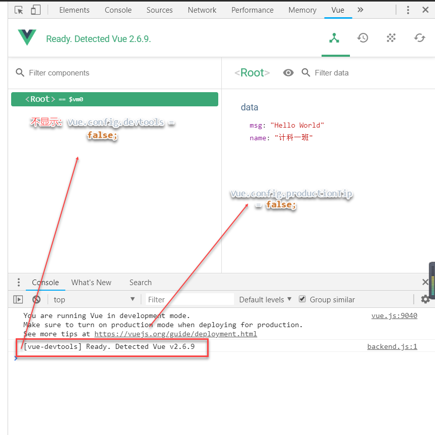
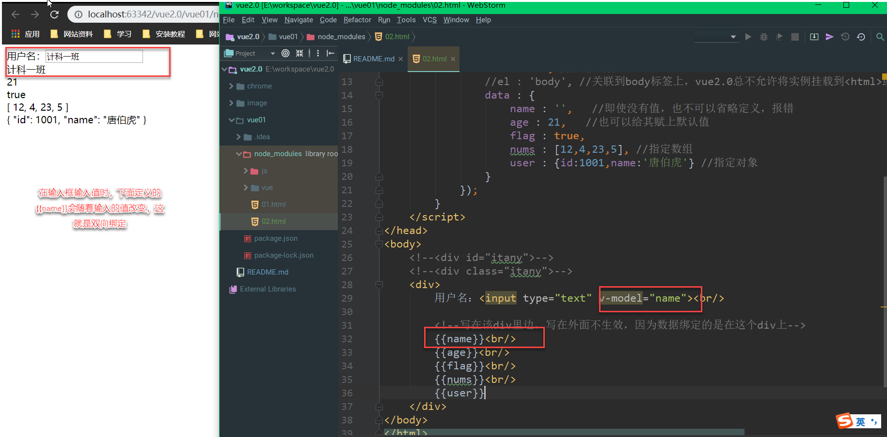

# Vue.js 2.0

## Vue.js是什么

**Vue.js**也称为Vue，读音/vju:/，类似view，错误读音v-u-e

- 是一个轻量级MVVM（Model-View-ViewModel）框架，和angular、react类似，其实就是所谓的数据双向绑定
- 通过简单的API实现**响应式的数据绑定**和**组合的视图组件**
- 更容易上手、小巧
- [官网](https://cn.vuejs.org/)

## vue
- 简单、易学、更轻量
- 指令以 v-xxx 开头
- HTML代码+JSON数据，再创建一个vue实例
- 由个人维护：**尤雨溪**，华人，2014.2开源了vue.js库
- 不兼容低版本IE

## 起步
### 下载核心库vue.js
```shell
bower info vue
npm init --yes
cnpm install vue --save  或者  npm install vue --save
```

Vue2.0和1.0相比，最大的变化就是引入 Virtual DOM(虚拟DOM)，页面更新效率更高，速度更快

### Hello World


#### vue实现

```html
<!DOCTYPE html>
<html lang="en">
<head>
    <meta charset="UTF-8">
    <title>Title</title>
    <!--引入vue.js库-->
    <script src="js/vue.js"></script>
    <script>
        //window.onload等待网页全部加载完再执行js，否则数据出不来，除非将js代码写在html下面
        window.onload = function () {

            //配置是否允许vue-devtools检查代码，方便调试，生产环境中需要指定为false，默认为true
            Vue.config.devtools = false;
            //阻止vue启动时生成生产消息
            Vue.config.productionTip = false;

            var vm = new Vue({ //就是创建一个vue对象，其中都是json
                el : '#itany',  //指定关联的选择器，这里指定了选择器的id
                data : {    //存储数据，json格式
                    msg : 'Hello World',
                    name : '计科一班'
                }
            });
        }
    </script>
</head>
<body>
    <div id="itany">
        {{msg}} <!--两对大括号{{}}称为模板，用来进行数据的绑定显示在在页面中-->
    </div>
</body>
</html>
```

运行时，打开Chrome控制台，会显示如下图所示，按照图中指示，即可隐藏掉。



#### 安装vue-devtools插件，便于在Chrome中调试

- 可在谷歌商店中安装，或者安装当前目录中的chrome文件夹，直接下载下来，拖到拓展程序中即可。

## 指令
### 什么是指令
用来扩展HTML标签的功能

### vue中常用指令
- `v-mode`，双向数据绑定，一般用于表单元素。[v-model]()


- `v-for`，对数组或对象进行循环操作，使用的是v-for。[v-for]()
    - 注：在vue1.0中提供了隐式变量，如$index，$key；在vue2.0中去除了隐式变量，已被废除
