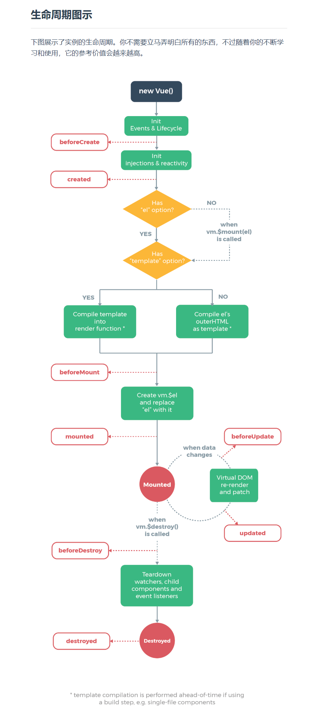

# Vue生命周期及实例的属性和方法
## Vue生命周期
- vue实例从创建到销毁的过程，称之为生命周期，共有八个阶段。
- [代码](https://github.com/wangwren/Vue-learning/blob/master/vue03/03.html)
- [官方讲解](https://cn.vuejs.org/v2/api/#%E9%80%89%E9%A1%B9-%E7%94%9F%E5%91%BD%E5%91%A8%E6%9C%9F%E9%92%A9%E5%AD%90)
- [官方提供的图示](https://cn.vuejs.org/v2/guide/instance.html#%E7%94%9F%E5%91%BD%E5%91%A8%E6%9C%9F%E5%9B%BE%E7%A4%BA)

## 计算属性(很重要)
### 基本用法
计算属性也是用来存储数据的，类似data属性，但是计算属性具有以下几个特点：
- 数据可以进行逻辑处理操作。
- 对计算属性中的数据进行监视。

### 计算属性 VS 方法
将计算属性的getter函数定义为一个方法也可以实现类似的功能，但是有区别：
- 计算属性是**基于它的依赖进行更新的**，只有在**相关依赖发生改变时才能更新变化**
- 计算属性是**缓存的**，只要相关依赖没有改变，多次访问计算属性得到的值是之前缓存的计算结果，不会多次执行。

### getter 和 setter
- 计算属性由两部分组成：getter和setter，分别用来**获取计算属性**和**设置计算属性**。
- 默认只有getter，如果需要setter，需要自己添加。
- 这部分挺重要，看代码吧。

[**计算属性**](https://github.com/wangwren/Vue-learning/blob/master/vue03/04.html)